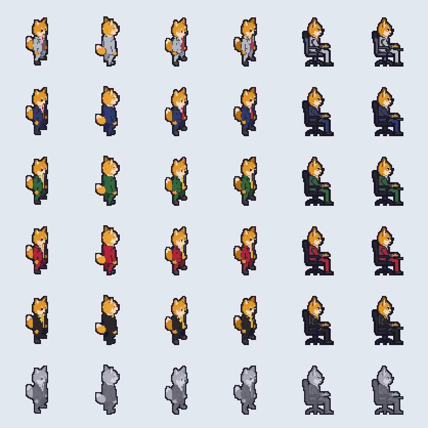

# pixel-site assets (Phase 2)

Style: **A Blueprint**, mixed as the owner picked: A3 density (desk clutter, wall ticker, chairs, bin, paper pile) with A2 oak desk tops, plants and lamp glow. All art is PixelLab; every edit is a free `pixelart_workbench` call.



## What is here

| File | What |
|---|---|
| `rats.png` + `rats.json` | One atlas for every rat: 6 looks x 55 frames, 68x68 cells, 1360x1224. One texture, so all 3,000 rats can batch. |
| `world.png` + `world.json` | Tiles and props (18 frames). |
| `manifest.json` | Every asset: the PixelLab tool, its exact args (prompt), the PixelLab id, the cost, and every free edit with its change list. |
| `raw/` | The untouched PixelLab outputs the atlases are built from. |
| `build/` | Intermediate sheets and every workbench change list and image id (`build/edits.json`). |
| `preview/` | `rats_all_tiers.gif` (tiers x animations), `world_atlas_2x.png`. |

## Rats (`rats.json`)

Looks (suit color carries the tier; every look has a 1px `#16182c` outer outline):

| Look | Suit | Tie |
|---|---|---|
| `intern` | brown/khaki | red |
| `analyst` | navy | red |
| `associate` | forest green | gold |
| `vp` | crimson | gold |
| `partner` | black, gold lapels, gold seams, gold collar from behind | wide gold |
| `frozen` | whole rat grey | grey |

Animations are keyed `<look>/<anim>`:

| Anim | Frames | Play | Notes |
|---|---|---|---|
| `walk_se`, `walk_ne` | 8 | loop, 10 fps | Mirror (`scale.x = -1`) for `sw` and `nw`. |
| `idle_se`, `idle_ne` | 4 | loop, 5 fps | |
| `type` | 7 | loop, 8 fps | Seated on its own black chair, facing screen right. Mirror to face left. |
| `slump` | 7 | once, then loop the last 3 | Seated, head drops, blue gloom scribble. |
| `cheer` | 9 | once | Standing, facing south-east, fists up. |
| `rot_<dir>` | 1 each | static | Standing frames for all 8 directions. |

Each frame carries an `anchor` at the feet (or the chair wheels), so a sprite placed at a cell centre stands on it. Per-frame `anchor` and the `animations` map are part of the PixiJS spritesheet format: VERIFIED in https://github.com/pixijs/pixijs/blob/dev/src/spritesheet/Spritesheet.ts (`SpritesheetFrameData.anchor`, `SpritesheetData.animations`, `sheet.animations[name]` for `AnimatedSprite`).

## World (`world.json`)

Isometric cell = 32 x 16 px. Tiles (`floor_office`, `floor_subway`, `floor_hq`, `wall`) anchor at the top apex of their top face; props anchor at their bottom centre. `ticker_wall` is the wall ticker with its demo numbers blanked (the site draws the live symbol and 24h % on it), pre-skewed 2:1 for a wall running down-right; `ticker_wall_busy` keeps the demo numbers. Mirror either for a wall running down-left.

Props: `desk_oak`, `desk_oak_clutter`, `chair`, `plant`, `lamp`, `cables`, `bin`, `papers`, `mug`, `stairs` (subway entrance), `furnace` (HQ), `cashbag` (burns).

## Rebuild or regenerate

```sh
pip install pillow
export PIXELLAB_API_KEY=...                       # never commit it
python3 tools/build_assets.py                     # rebuild atlases from raw/ (free, about 2 minutes)
python3 tools/regenerate.py <id>                  # show one generation's call and cost (dry run)
python3 tools/regenerate.py <id> --yes            # re-run it into raw/ (spends the listed generations)
```

`create_character`, `create_map_object`, `edit_image_pixen` and `animate_image` take no seed over MCP, so a regeneration is a new variation of the same prompt. Tiles take a seed (in the manifest).

## Cost

20 generations are in these assets (6 from Phase 1, 3 from the style A variations, 11 in Phase 2). The account has used 32 of its 40 trial generations (12 went to the B and C style samples); 8 are left.
