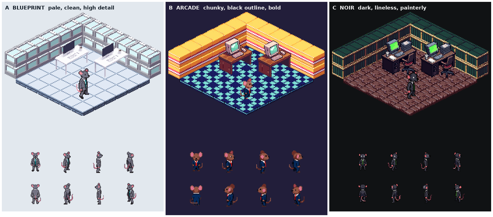

# Phase 1 style samples

Three candidate looks for the RAT RACE pixel site. Each one has a rat in a suit (8 directions, idle and walk facing south-east) and a small office set (floor tile, wall block, desk). Everything was generated with the PixelLab MCP tools; `manifest.json` has the exact call and PixelLab id for every file.

| Style | One line | Rat size |
|---|---|---|
| **A Blueprint** (`a-blueprint/`) | Pale and clean, soft selective outline, high detail. Airy, closest to a bright office floor. | 68px canvas |
| **B Arcade** (`b-arcade/`) | Chunky 16-bit, black outline, flat bold colors, chibi rat. Most readable when thousands of rats are on screen. | 48px canvas |
| **C Noir** (`c-noir/`) | Dark and lineless with painterly shading and CRT green glow. Strongest mood, hardest to read small. | 68px canvas |

Animated: `compare.gif` (all three rooms, idle then walk), and per style `room.gif`, `preview_idle.gif`, `preview_walk.gif`.

## Files per style

| File | What |
|---|---|
| `floor.png`, `wall.png` | `create_isometric_tile`, 32px (thin tile, block) |
| `desk.png` | `create_map_object`, 64x64 |
| `rat_rotations.png` | `create_character` standard mode, 8 rotations in order S, SE, E, NE, N, NW, W, SW |
| `rat_idle.png`, `rat_walk.png` | `animate_character` template `breathing-idle` (4 frames) and `walking-8-frames` (8 frames), south-east |
| `room.png`, `room.gif`, `preview_*.gif` | Layouts and upscales of the files above. No extra art. |

## Cost

18 PixelLab generations for all three styles (9 tiles and desks, 3 characters, 6 one-direction animations).
